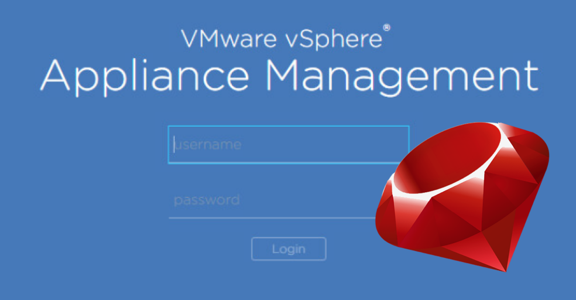

# rbvami - a Ruby module for managing vCSA VAMI
## Overview
A Ruby module for configuring vCSA 6.5 VAMI via public REST API

## Development Ideas
* Initially cover just VAMI functionality, later may add full REST coverage
* Will not include 'techpreview' API calls at this stage
* Idea is to develop module into a Chef cookbook for managing VAMI configuration
